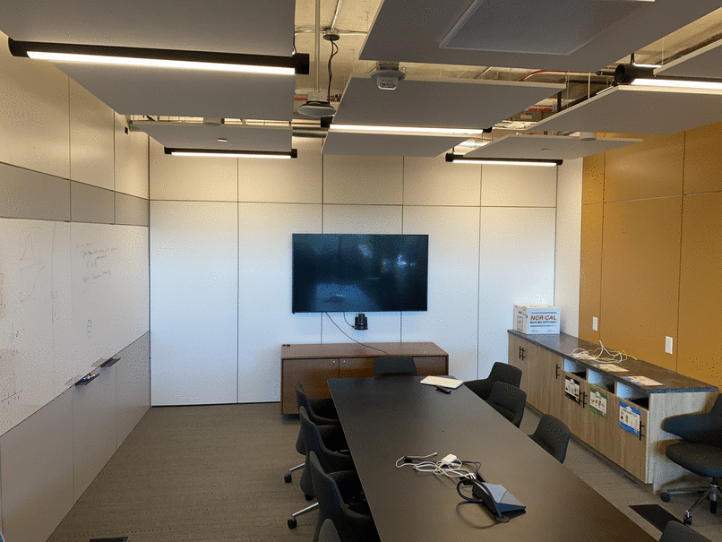
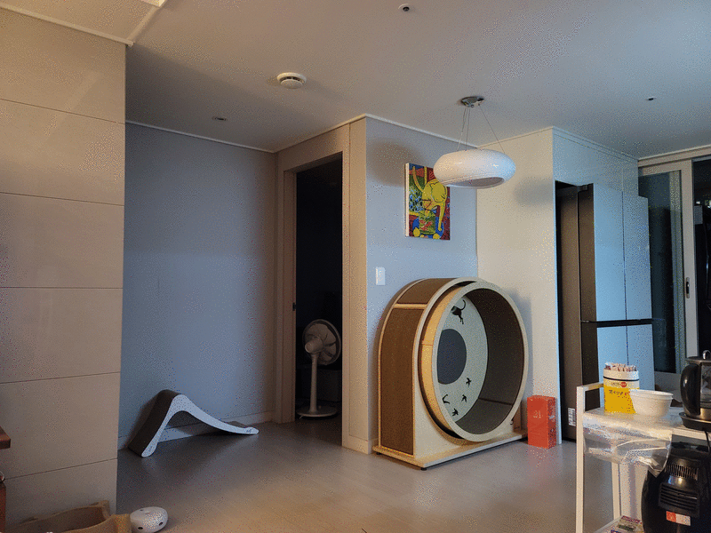
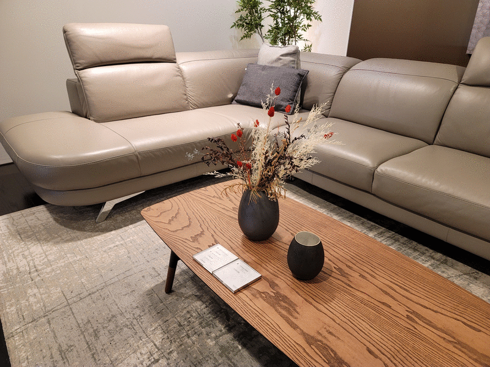
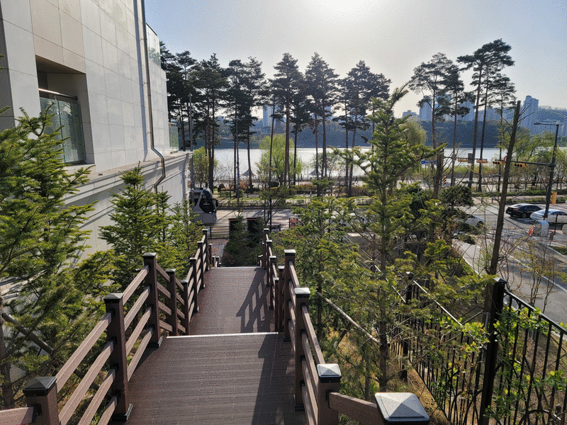

# Welcome to ReMo World!
This repository was designed to demonstrate the mid-term results of the ReMo project in OpenLab.

## Interactive 3D Photo
View synthesis technique can serve the free-viewpoint rendering to users using just a few photos.

### Public Dataset
|   |  |
| :---: | :---: |
| <b>T-Rex</b> | <b>Room</b> |
| [[Mobile](https://remo-openlab.github.io/viewer/mobile.html?scene=https://remo-openlab.github.io/mpi/trex/400)] [[PC](https://remo-openlab.github.io/viewer/viewer.html?scene=https://remo-openlab.github.io/mpi/trex/1008)] | [[Mobile](https://remo-openlab.github.io/viewer/mobile.html?scene=https://remo-openlab.github.io/mpi/room/400)] [[PC](https://remo-openlab.github.io/viewer/viewer.html?scene=https://remo-openlab.github.io/mpi/room/1008)] |

### Custom Dataset
|  |  |
| :---: | :---: |
| <b>Kitchen</b> | <b>Wall</b> |
| [[Mobile](https://remo-openlab.github.io/viewer/mobile.html?scene=https://remo-openlab.github.io/mpi/kitchen/400)] [[PC](https://remo-openlab.github.io/viewer/viewer.html?scene=https://remo-openlab.github.io/mpi/kitchen/1008)] | [[Mobile](https://remo-openlab.github.io/viewer/mobile.html?scene=https://remo-openlab.github.io/mpi/wall/400)] [[PC](https://remo-openlab.github.io/viewer/viewer.html?scene=https://remo-openlab.github.io/mpi/wall/1024)] |
|  |  |
| <b>Steak</b> | <b>Settimio</b> |
| [[Mobile](https://remo-openlab.github.io/viewer/mobile.html?scene=https://remo-openlab.github.io/mpi/steak/400)] [[PC](https://remo-openlab.github.io/viewer/viewer.html?scene=https://remo-openlab.github.io/mpi/steak/1024)] | [[Mobile](https://remo-openlab.github.io/viewer/mobile.html?scene=https://remo-openlab.github.io/mpi/settimio/400)] |
|  |  |
| <b>Lake Front</b> | <b>Joongheng</b> |
| [[Mobile](https://remo-openlab.github.io/viewer/mobile.html?scene=https://remo-openlab.github.io/mpi/lake-front/400)] | [[Mobile](https://remo-openlab.github.io/viewer/mobile.html?scene=https://remo-openlab.github.io/mpi/joongheung/400)] |

<!-- ### Public Dataset
| Input |   |  |
| :---: | :---: | :---: |
| Scene | <b>T-Rex</b> | <b>Room</b> |
| 3D | [[Mobile](https://remo-openlab.github.io/viewer/mobile.html?scene=https://remo-openlab.github.io/mpi/trex/400)] [[PC](https://remo-openlab.github.io/viewer/viewer.html?scene=https://remo-openlab.github.io/mpi/trex/1008)] | [[Mobile](https://remo-openlab.github.io/viewer/mobile.html?scene=https://remo-openlab.github.io/mpi/room/400)] [[PC](https://remo-openlab.github.io/viewer/viewer.html?scene=https://remo-openlab.github.io/mpi/room/1008)] |

### Custom Dataset
| Input |  |  |
| :---: | :---: | :---: |
| Scene | <b>Kitchen</b> | <b>Wall</b> |
| 3D | [[Mobile](https://remo-openlab.github.io/viewer/mobile.html?scene=https://remo-openlab.github.io/mpi/kitchen/400)] [[PC](https://remo-openlab.github.io/viewer/viewer.html?scene=https://remo-openlab.github.io/mpi/kitchen/1008)] | [[Mobile](https://remo-openlab.github.io/viewer/mobile.html?scene=https://remo-openlab.github.io/mpi/wall/400)] [[PC](https://remo-openlab.github.io/viewer/viewer.html?scene=https://remo-openlab.github.io/mpi/wall/1024)] |
| Input |  |  |
| Scene | <b>Steak</b> | <b>Settimio</b> |
| 3D | [[Mobile](https://remo-openlab.github.io/viewer/mobile.html?scene=https://remo-openlab.github.io/mpi/steak/400)] [[PC](https://remo-openlab.github.io/viewer/viewer.html?scene=https://remo-openlab.github.io/mpi/steak/1024)] | [[Mobile](https://remo-openlab.github.io/viewer/mobile.html?scene=https://remo-openlab.github.io/mpi/settimio/400)] |
| Input |  |  |
| Scene | <b>Lake Front</b> | <b>Joongheng</b> |
| 3D | [[Mobile](https://remo-openlab.github.io/viewer/mobile.html?scene=https://remo-openlab.github.io/mpi/lake-front/400)] | [[Mobile](https://remo-openlab.github.io/viewer/mobile.html?scene=https://remo-openlab.github.io/mpi/joongheung/400)] |
 -->
