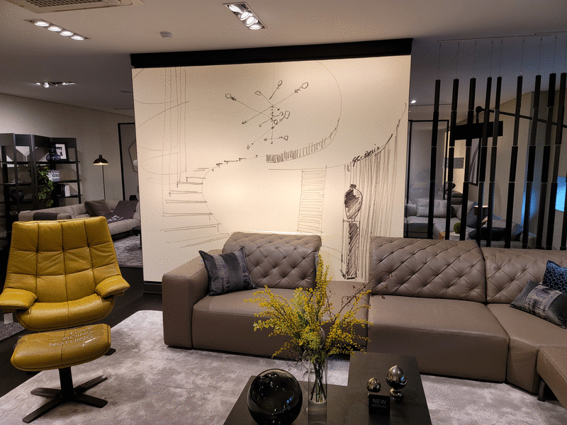

# Welcome to ReMo World!
This repository was designed to demonstrate the mid-term results of the ReMo project in OpenLab.

## View Synthesis
View synthesis technique can serve the free-viewpoint rendering to users using just a few photos (10~20).

|   |  |  |
|:---:|:---:|:---:|
| <b>Tiger</b> | <b>Kitchen</b> | <b>Wall</b> |
| [[Mobile](https://remo-openlab.github.io/viewer/mobile.html?scene=https://remo-openlab.github.io/mpi/tiger/400)] [[PC](https://remo-openlab.github.io/viewer/viewer.html?scene=https://remo-openlab.github.io/mpi/tiger/1008)] | [[Mobile](https://remo-openlab.github.io/viewer/mobile.html?scene=https://remo-openlab.github.io/mpi/kitchen/400)] | [[Mobile](https://remo-openlab.github.io/viewer/mobile.html?scene=https://remo-openlab.github.io/mpi/wall/400)] |
|   |  |  |
| <b>Tiger</b> | <b>Kitchen</b> | <b>Wall</b> |
| [[Mobile](https://remo-openlab.github.io/viewer/mobile.html?scene=https://remo-openlab.github.io/mpi/sofa/400)] [[PC](https://remo-openlab.github.io/viewer/viewer.html?scene=https://remo-openlab.github.io/mpi/sofa/1024)] | [[Mobile](https://remo-openlab.github.io/viewer/mobile.html?scene=https://remo-openlab.github.io/mpi/steak/400)] [[PC](https://remo-openlab.github.io/viewer/viewer.html?scene=https://remo-openlab.github.io/mpi/steak/1024)] | [[Mobile](https://remo-openlab.github.io/viewer/mobile.html?scene=https://remo-openlab.github.io/mpi/snu-house/400)] |
