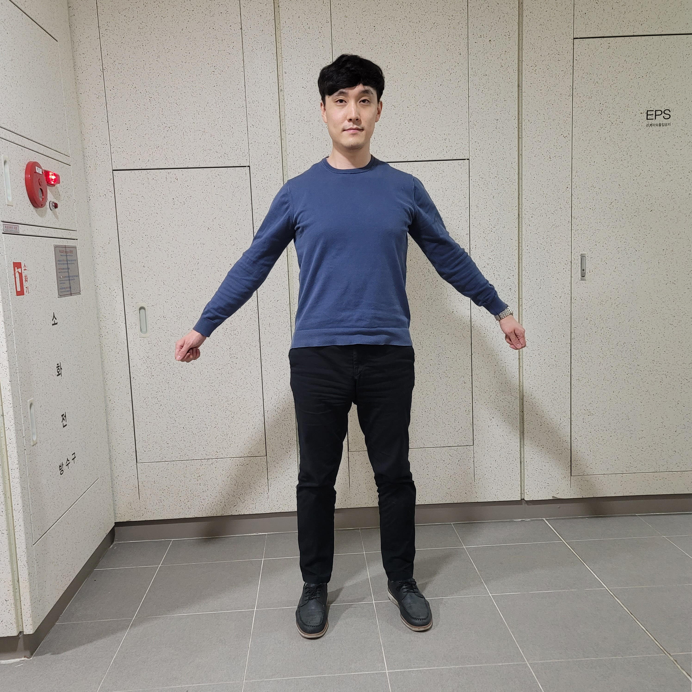
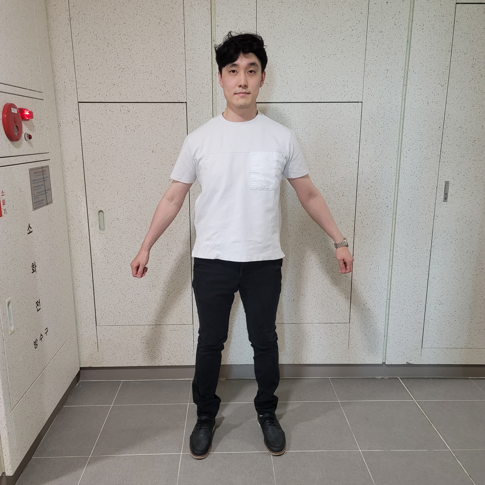
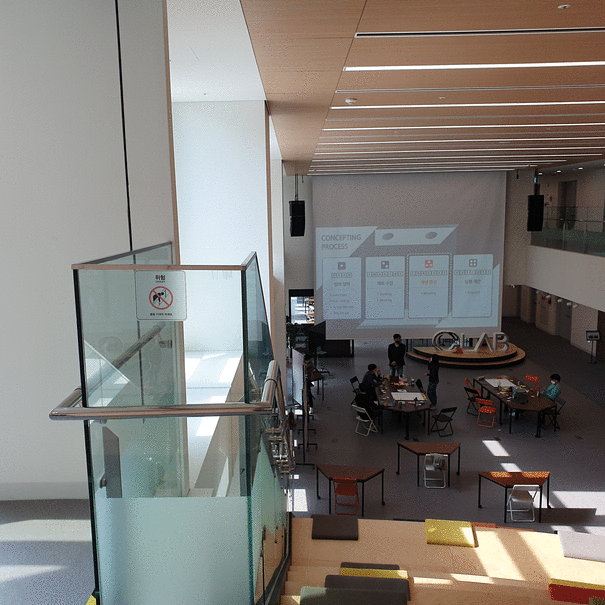

# Welcome to ReMo World!
This repository was designed to demonstrate the mid-term results of the ReMo project in OpenLab.

## Animatable 3D Avatar
To create a photo-realistic animatable 3D avatar, we are building an end-to-end pipeline which consists of 3D human shape reconstruction, texture mapping, and skeleton rigging and skinning for animation.

### AR Use Case

| Input |   |  |
| :---: | :---: | :---: |
| Scene | <b>Table</b> | <b>Floor</b> |
| AR | <figure class="video_container"> <iframe width="400" height="858" src="https://www.youtube.com/embed/evA6gtYcjSo" title="YouTube video player" frameborder="0" allow="autoplay; encrypted-media;" allowfullscreen></iframe> </figure> | <figure class="video_container"> <iframe width="400" height="858" src="https://www.youtube.com/embed/lhO3J7chAeA" title="YouTube video player" frameborder="0" allow="autoplay; encrypted-media;" allowfullscreen></iframe> </figure>|

<!-- | Jisung Business | Jisung Casual |
| :---: | :---: |
|   |  |

### AR Use Case : Table

<iframe width="400" height="858" src="https://www.youtube.com/embed/evA6gtYcjSo" title="YouTube video player" frameborder="0" allow="autoplay; encrypted-media;" allowfullscreen></iframe>

<!-- https://user-images.githubusercontent.com/87857243/130650622-dcc8175b-88c4-44a6-a597-90562f1d7599.mp4 -->

<!-- ### AR Use Case : Floor

<iframe width="400" height="858" src="https://www.youtube.com/embed/lhO3J7chAeA" title="YouTube video player" frameborder="0" allow="autoplay; encrypted-media;" allowfullscreen></iframe>

<!-- https://user-images.githubusercontent.com/87857243/130647745-35d355da-c98c-40a5-acee-92fd211aa78d.mp4 -->
--> -->

## Interactive 3D Photo
View synthesis technique can serve the free-viewpoint rendering to users using just a few photos. We made the interactive 3D photos using the latest multi-plane image-based neural rendering. And we are also trying to extend the existing scene structure from planar surfaces to spherical ones for VR use cases.

### Public Dataset

| Input |   |  |
| :---: | :---: | :---: |
| Scene | <b>T-Rex</b> | <b>Room</b> |
| 3D | [[Mobile](https://remo-openlab.github.io/viewer/mobile.html?scene=https://remo-openlab.github.io/mpi/trex/400)] [[PC](https://remo-openlab.github.io/viewer/viewer.html?scene=https://remo-openlab.github.io/mpi/trex/1008)] | [[Mobile](https://remo-openlab.github.io/viewer/mobile.html?scene=https://remo-openlab.github.io/mpi/room/400)] [[PC](https://remo-openlab.github.io/viewer/viewer.html?scene=https://remo-openlab.github.io/mpi/room/1008)] |

### Custom Dataset

| Input |  |  |  |  |
| :---: | :---: | :---: | :---: | :---: |
| Scene | <b>C-Lab Square</b> | <b>Wall</b> | <b>Galleria</b> | <b>Kitchen</b> |
| 3D | [[Mobile](https://remo-openlab.github.io/viewer/mobile.html?scene=https://remo-openlab.github.io/mpi/clab-square/400)] [[PC](https://remo-openlab.github.io/viewer/viewer.html?scene=https://remo-openlab.github.io/mpi/clab-square/1008)] | [[Mobile](https://remo-openlab.github.io/viewer/mobile.html?scene=https://remo-openlab.github.io/mpi/wall/400)] [[PC](https://remo-openlab.github.io/viewer/viewer.html?scene=https://remo-openlab.github.io/mpi/wall/1024)] | [[Mobile](https://remo-openlab.github.io/viewer/mobile.html?scene=https://remo-openlab.github.io/mpi/galleria-01/400)] [[PC](https://remo-openlab.github.io/viewer/viewer.html?scene=https://remo-openlab.github.io/mpi/galleria-01/1008)] | [[Mobile](https://remo-openlab.github.io/viewer/mobile.html?scene=https://remo-openlab.github.io/mpi/kitchen/400)] [[PC](https://remo-openlab.github.io/viewer/viewer.html?scene=https://remo-openlab.github.io/mpi/kitchen/1024)] |
| Input |  |  |  |  |
| Scene | <b>Steak</b> | <b>Settimio</b> | <b>Lake Front</b> | <b>Joongheng</b> |
| 3D | [[Mobile](https://remo-openlab.github.io/viewer/mobile.html?scene=https://remo-openlab.github.io/mpi/steak/400)] [[PC](https://remo-openlab.github.io/viewer/viewer.html?scene=https://remo-openlab.github.io/mpi/steak/1024)] | [[Mobile](https://remo-openlab.github.io/viewer/mobile.html?scene=https://remo-openlab.github.io/mpi/settimio/400)] [[PC](https://remo-openlab.github.io/viewer/viewer.html?scene=https://remo-openlab.github.io/mpi/settimio/1008)] | [[Mobile](https://remo-openlab.github.io/viewer/mobile.html?scene=https://remo-openlab.github.io/mpi/lake-front/400)] | [[Mobile](https://remo-openlab.github.io/viewer/mobile.html?scene=https://remo-openlab.github.io/mpi/joongheung/400)] |

<!-- | Input |  |  |
| :---: | :---: | :---: |
| Scene | <b>C-Lab Square</b> | <b>Wall</b> |
| 3D | [[Mobile](https://remo-openlab.github.io/viewer/mobile.html?scene=https://remo-openlab.github.io/mpi/clab-square/400)] [[PC](https://remo-openlab.github.io/viewer/viewer.html?scene=https://remo-openlab.github.io/mpi/clab-square/1008)] | [[Mobile](https://remo-openlab.github.io/viewer/mobile.html?scene=https://remo-openlab.github.io/mpi/wall/400)] [[PC](https://remo-openlab.github.io/viewer/viewer.html?scene=https://remo-openlab.github.io/mpi/wall/1024)] |
| Input |  |  |
| Scene | <b>Galleria</b> | <b>Kitchen</b> |
| 3D | [[Mobile](https://remo-openlab.github.io/viewer/mobile.html?scene=https://remo-openlab.github.io/mpi/galleria-01/400)] [[PC](https://remo-openlab.github.io/viewer/viewer.html?scene=https://remo-openlab.github.io/mpi/galleria-01/1008)] | [[Mobile](https://remo-openlab.github.io/viewer/mobile.html?scene=https://remo-openlab.github.io/mpi/kitchen/400)] [[PC](https://remo-openlab.github.io/viewer/viewer.html?scene=https://remo-openlab.github.io/mpi/kitchen/1024)] |
| Input |  |  |
| Scene | <b>Steak</b> | <b>Settimio</b> |
| 3D | [[Mobile](https://remo-openlab.github.io/viewer/mobile.html?scene=https://remo-openlab.github.io/mpi/steak/400)] [[PC](https://remo-openlab.github.io/viewer/viewer.html?scene=https://remo-openlab.github.io/mpi/steak/1024)] | [[Mobile](https://remo-openlab.github.io/viewer/mobile.html?scene=https://remo-openlab.github.io/mpi/settimio/400)] [[PC](https://remo-openlab.github.io/viewer/viewer.html?scene=https://remo-openlab.github.io/mpi/settimio/1008)] |
| Input |  |  |
| Scene | <b>Lake Front</b> | <b>Joongheng</b> |
| 3D | [[Mobile](https://remo-openlab.github.io/viewer/mobile.html?scene=https://remo-openlab.github.io/mpi/lake-front/400)] | [[Mobile](https://remo-openlab.github.io/viewer/mobile.html?scene=https://remo-openlab.github.io/mpi/joongheung/400)] | -->

